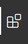
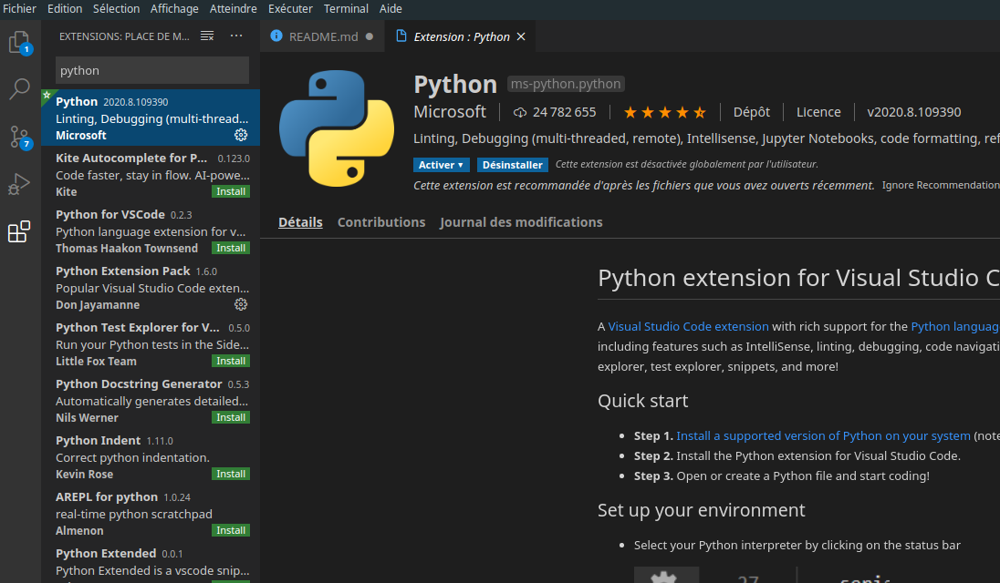
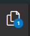
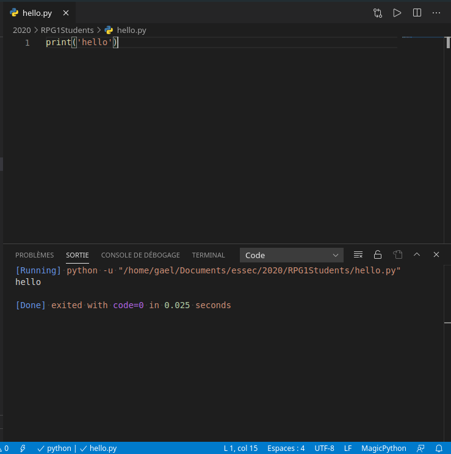

# ESSEC GBBA Python and Programming
Introduction to programming (using Python 3). Courses made for ESSEC Business School (Global BBA).

In this course you will learn the basics of programming and programming with Python. Elementary notions will be displayed in jupyter notebooks. To use these files you will need to either:
1. Install python locally (following the instructions below)
2. Visit the interactive jupyter supports (made for online teaching without any installation required - but only available during courses - )

Please visit this link for interactive supports :
[https://mybinder.org/v2/gh/gguibon/essec-python-1/master?filepath=python-1.ipynb](https://mybinder.org/v2/gh/gguibon/essec-python-1/master?filepath=python-1.ipynb)


## Install local Python environnement
At home you may want to use Python locally. Please follow these steps:
1. Download the latest Python (Python3 not 2) from here: [https://www.python.org/downloads/](https://www.python.org/downloads/)
2. Install it (if you are using Ubuntu 16.04 you already have Python installed)

Start using it:
- Open terminal(unix/mac) or CommandLine(windows), type `python` or `python3` or `py` (depends on your environnement) to start an interactive python environnement
- Create a file named `my_super_program.py`, type `print('hello')` inside, and save. Execute this file by typing `python3 my_super_program.py`.

To run jupyter notebooks (.ipynb files with interactive python), please open a terminal and type:
```
pip install jupyter
```
Then run it using: `jupyter notebook`

## Install developpement environnement
To code with ease you may need an IDE for smoother coding. I would suggest [Visual Studio Code](https://code.visualstudio.com/Download) combined with the Python plugin from Microsoft (ms-python.python). For a python only IDE the best one would be [PyCharm](https://www.jetbrains.com/pycharm/).


### Here is the detailed procedure for Visual Studio Code set up from scratch:

1. Download and install the latest Python (Python3, not 2! Python2 is dead) from here: [https://www.python.org/downloads/](https://www.python.org/downloads/)
2. Download and install Visual Studio Code [Visual Studio Code](https://code.visualstudio.com/Download)
3. Install the Python Microsoft plugin in Visual Studio Code by clicking on the extension panel 
 :

4. Once it is done you can go back to the file view , create a new file with '.py' extension (i.e. a python file such as 'hello.py'), type `print('hello')` in it and save (Ctrl + S).
5. Now you can run any python file you are viewing by clicking on the  button (top right). Here is an example:

